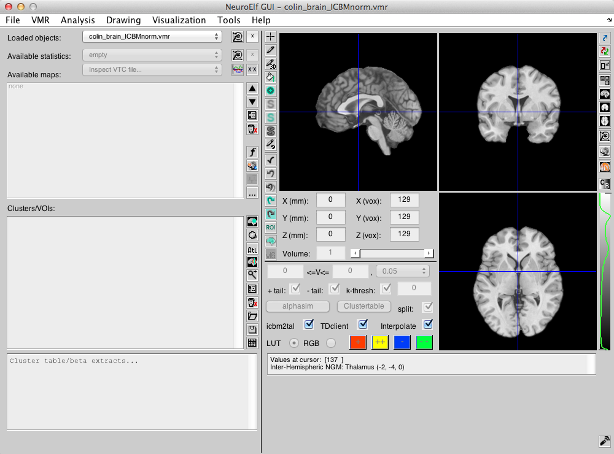
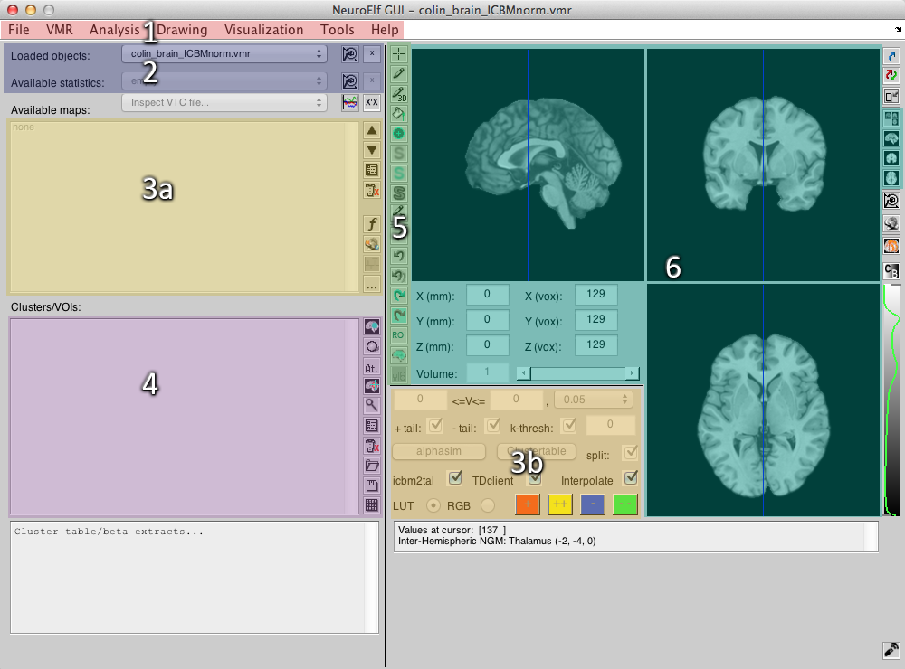
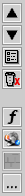
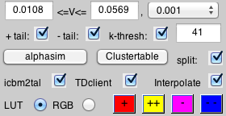
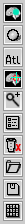
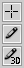
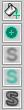
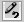
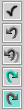

# NeuroElf (MATLAB)

## User manual



### Preface

#### What NeuroElf is and what it's not

NeuroElf is a MATLAB toolbox supposed to facilitate a sub-set of neuro-functional imaging applications (preprocessing, regressions, visualization, post-hoc data extraction and analyses, etc.). The GUI (graphical user interface) that comes with NeuroElf is able to visualize and work on typically used voxel-based (and selected surface) file formats. The best analogy that comes to mind is that of a Swiss Army knife of neuro-functional imaging tools. That being said, it's important to understand what NeuroElf is not...

NeuroElf is, in itself, not a toolbox or program with which all aspects of imaging applications can be done. Most importantly, it does not come with a full set of preprocessing routines, mainly spatial normalization to a template space, and it thus requires at least one other major neuro-imaging application, such as SPM, FSL, or BrainVoyager QX to bring raw scanner data into a format and representation that allows group-based analyses. As a method of choice, SPM-based preprocessing can be easily configured and executed using a separate graphical interface in NeuroElf.

Generally speaking, the functionality implemented in NeuroElf can be understood as a set of tools that will facilitate and complement the (pre-) processing, as it is implemented in SPM5 or SPM8 (SPM12 support will be added shortly) as well as provide the user with relatively easy to script functions to access and visualize the resulting data. On its own, it allows to run either ordinary-least-squares or robust regressions on preprocessed data files, with a variety of options for nuisance regressors, parametric regression, (non-deconvolved and re-convolved) PPI, seed-correlations, and a relatively simple to use contrast manager together with beta extraction and time course plotting capabilities.

Most of the focus and effort in developing and implementing NeuroElf has been placed on making these processes as accessible and hassle-free as possible for the non-Computer-Science user, i.e. for psychologists.

Another large portion of features in NeuroElf relates to the visualization and ease of extracting data after an analysis has been run. To that end, NeuroElf features high-resolution slice-based montages--i.e. overlaying statistical information as colored heat-maps on anatomical data--, surface-based representation of data, and a 3D rendering engine. Additional features also include a beta plotter (more on that later), and a graphical interface visualizing stimulus onset-locked region-averaged time courses (event-related averaging).

In short, some of the main reasons to use NeuroElf are to simplify SPM-based preprocessing, to perform regression analyses, and to visualize and dig into the results of those.

Some additional tools, such as (single-level) mediation analyses, meta analyses, single-run ICA, linear classification, etc. are available, but not all of these have yet been fully implemented in the GUI, and as such may only be fully utilized by a more experienced MATLAB user. If you find a tool that you believe is suitable for inclusion in NeuroElf, please feel free to contact me with a request at info@neuroelf.net.

#### Acknowledgments

While most of the coding has been done by the main author, the following people deserve special mention for their countless contributions to the process of making and improving on NeuroElf:

Hedy Kober, who is now an Assistant Professor of Psychiatry and Psychology at Yale University, New Haven, CT. Hedy has, over the years, been extremely helpful by suggesting countless improvements in the user interface and in pointing out several bugs and issues. In addition, she has been a good friend and her very enthusiastic approach to NeuroElf and advocacy outside of Columbia University certainly kept it from ever becoming a "dead-end project".

Kevin Ochsner, who is a Professor of Psychology at Columbia University, New York, NY, has provided the means and, also funded by his research grants, most of the datasets on which NeuroElf's features were tested initially.

Additionally, thanks go to Cameron DeLeone, Federico DeMartino, Bryan Denny, Fabrizio Esposito, Andrew Gerber, Rainer Goebel, Armin Heinecke, Katie Insel, Zoran Josipovic, Jenna Reinen, Ajay Satpute, Jen Silvers, Jared van Snellenberg, and Noam Zerubavel, for being heavy users and contributors to the process of making NeuroElf a better version of itself over time, by finding bugs and sharing their preferences for working with functional imaging data, which makes the foundation of a user-friendly UI.

Some code has been loaned from other authors:

* Chih-Chung Chang and Chih-Jen Lin, the authors of LIBSVM
* Aapo Hyv&auml;rinen, the author of the FastICA algorithm
* Dirk-Jan Kroon, the author of the shear-warp rendering algorithm

And last but not least, I thank my partner, Changyu Zhu, who supports me at times when things seem a bit pointless, so I keep moving on anyway.

### Overview

The NeuroElf toolbox has three main components, a graphical user interface (`neuroelf_gui`), a file handling class (`@xff`) and a library of functions for general data processing (`@neuroelf`).

This readme (manual) uses the following notation: two greater-than symbols at the beginning of a paragraph (>>) in a "code box" indicate a single line of code to be entered at the MATLAB prompt (please enter without the >> symbols!). For a longer paragraph of code, an initial line (and possibly one or several subsequent lines) will begin with a per-cent symbol (%) indicating a MATLAB comment.

#### Installation

Depending on whether you downloaded the installation M-file+MAT-file version, or the flat folder version, or cloned from github, instructions slightly differ.

The archive containing NeuroElf is about 30 Megabytes in length. Once unpacked and installed, NeuroElf requires at least 100 Megabyte and, if all additional files are created, can require as much as 2.5 Gigabyte of disk space. So please make sure that the folder you choose as installation folder is on a medium that offers enough free space (i.e. does not come with a hard limitation or quota).

Please be aware that as a user of NeuroElf, you should have write-access to a few critical folders located in the `_files` folder, and also the files located in the `_core/config` folder. Without write access in these folders some functions may not work properly!

##### M-file version installation

To install NeuroElf, unzip the content (three files: `NeuroElf_v11.m`, `NeuroElf_v11.mat`, and `ne_eo.m`), then open MATLAB and change the current folder into the folder containing those three files. Then enter

```
>> NeuroElf_v11 -i
```

to start the installation process. You will be asked where to install the toolbox, with the default being the toolbox folder of your MATLAB installation. If you do not have write permissions in that folder, please choose "n" when being asked whether this is a good location and then enter a more suitable folder path. If in doubt, enter a path within your home folder (unless there is a quota restriction in place, at which point you should talk to your system administrator to determine a good location).

##### Flat folder version installation

Simply unzip the archive and move the unpacked files into a folder where you would like to install the toolbox. This should be a folder without spaces or other non alphanumeric characters in its full path and name.

##### NeuroElf setup function

After the files are successfully unpacked, the function `neuroelf_setup` must be called. If you installed using the M-file version, this will be done automatically. Otherwise, please enter

```
>> neuroelf_setup
```

at the MATLAB prompt manually. This function ensures that the toolbox has been correctly installed and is functional. At the end of this procedure, you will be asked whether `neuroelf_makefiles` (from the `@neuroelf` library) should be called as well. If you have also downloaded the auxiliary files (Colin brain, etc.; see below) and unpacked those into the `_files/colin` subfolder of the installation, you can safely say no. Otherwise, it is recommended that you let NeuroElf generate these additional files (which will take somewhere between 20 and 50 minutes, depending on your computer's speed and available free memory).

#### Folder structure

The installation folder has the following folder structure:

* `@neuroelf/` - class containing the function library within its private subfolder
* `@transimg/` - class used to blend 2D (RGB) images together
* `@transio/` - class allowing transparent IO file access (for large datasets)
* `@xff/` - class giving access to a variety of file formats (including functions/methods)
* `@xfigure/` - class providing object-oriented design patterns for to MATLAB's graphics handles
* `@xini/` - class providing an interface to *.ini configuration files
* `@xprogress/` - simplified class for progress bars
* `_core/` - control, text, and image files required for NeuroElf's core functionality
* `_files/` - auxiliary files required for additional functions

#### Files coming with NeuroElf

NeuroElf comes with a 1-mm resolution version of Colin Holmes' 27-scan average brain image, and a set of derived images and surface reconstructions is generated during the `neuroelf_makefiles` call, including 0.5-mm resolution versions for improved visualizations, sub-cortical surfaces, as well as flattened meshes and a head mesh for more complex surface scenes. These files must be located in the `_files/colin` subfolder of the installation. Some preliminary masks have also been derived from this dataset, and those are stored in the `_files/masks` subfolder.

In addition, NeuroElf contains a copy of the original Talairach labeled brain atlas, together with transformation files that relate this atlas approximately to ICBM/MNI space (derived using SPM8's segmentation on a ternary labeled version of the atlas). Files related to the Talairach atlas are located in the `_files/tal` subfolder.

Lastly, the `neuroelf_makefiles` function optionally downloads and installs a 1-mm resolution full-brain, anatomical-T1 DARTEL template from NeuroElf's website to allow using SPM8's DARTEL tools to warp any subject's brain (anatomical and functional data, if aligned) to a slightly better matching ICBM/MNI space. This template was derived from 305 anatomical scans collected at Columbia University over the course of 11 studies, and also included Colin Holmes' 27-scan average brain. These files will be stored in the `_files/spm/dartel/Template1mm` subfolder.

Further subfolders in the `_files` folder contain the cached information of the `@xff` class (which speeds up initializing NeuroElf considerably across MATLAB sessions); additional M-files in the `_files/contrib` folder that may be of interest for users who want to script NeuroElf; files downloaded from NeuroSynth (via the File -> NeuroSynth maps menu entry in the GUI) will be stored in `_files/neurosynth/terms`; SPM processing job specification files are stored in `_files/spm`; and a small set of predefined surface files (sphere, cylinder, cube) are located in `_files/srf`.

### The NeuroElf GUI

The GUI component can be started up by entering

```
>> neuroelf_gui
```

on the MATLAB prompt. Below is a screenshot of the GUI with some areas highlighted that will be explained in greater detail in this chapter.


###### NeuroElf GUI with highlighted areas: 1. Menu; 2. Object selector; 3a. Statistical map selector; 3b. Statistical map configuration; 4. Cluster/VOI tools; 5. Drawing tools; 6. Slice-based dataset view and browsing controls

#### GUI outline

The highlighted areas are:

1. Menu: used to configure NeuroElf (mostly under the File -> Options menu entry) and call functions or open additional UIs (e.g. for the GLM contrast manager or montage configuration).
2. File selector: used to switch between loaded objects, to set the orientation (translation, rotation, size) for objects, and to close (unload) the currently selected object--both for anatomical and statistical datasets.
3a. Statistical map selector: used to select one or multiple maps (in the same dataset); the button functions are

<table border=0 cellpadding=0><tr><td rowspan=9 height=196></td>
<td height=22>move selected map(s) up the list</td></tr>
<tr><td height=20>move selected map(s) down the list</td></tr>
<tr><td height=20>inspect and/or change map properties (name, stats type, DF)</td></tr>
<tr><td height=20>delete selected map(s) from the container object </td></tr>
<tr><td height=16></td>
<tr><td height=20>compute a formula (expression) on map values</td></tr>
<tr><td height=20>sample selected maps into surface space (with selected surfaces)</td></tr>
<tr><td height=20>open GLM beta plotter (if GLM selected or referenced)</td></tr>
<tr><td height=20>select maps with same name across subjects (for GLMs)</td></tr>
</table>

3b. Statistical map configuration: used to configure a single statistical map (thresholds, visible tails, cluster size thresholding, coloring).

<table border=0><tr><td height=144></td>
<td width=420>The two edit boxes with values represent the lower and upper threshold for the currently selected (single) map. All statistical values (absolutely) below the lower boundary will not be shown (transparent). For LUT configuration, values will be scaled between 1 and the number of lookup-colors defined in the LUT and then be shown in that color. For RGB configuration, all values above the upper boundary will be shown in the colors configured with the "++" and "--" buttons (depending on the sign of the statistic and enabled tails). Values inbetween the boundaries will be shown in a color between the "+" and "++" color for the positive tail or between the "-" and "--" colors for the negative tail. The p-value dropdown can be used to set a specific p-value as the lower boundary. The p-value will be converted into the appropriate statistical threshold by NeuroElf. In addition to a "height threshold", a cluster size (extent) threshold can be set in the edit box following the "k-thresh:" label and enable with the checkbox right before.</td></table>

4. Cluster/VOI tools: used to select a cluster and update the cursor position to its peak coordinate, also possibly auto-extracting data from clusters. The buttons can be used to:

<table border=0 cellpadding=0><tr><td rowspan=10 height=224></td>
<td height=22>highlight selected clusters in VMR</td></tr>
<tr><td height=20>restrict selected clusters to a sphere around the peak (or create spherical ROI)</td></tr>
<tr><td height=20>add VOI from Talairach atlas labels</td></tr>
<tr><td height=20>goto cluster peak closest to current browsing location</td></tr>
<tr><td height=20>zoom in on currently selected cluster</td></tr>
<tr><td height=20>cluster properties (not yet implemented)</td></tr>
<tr><td height=20>remove selected clusters</td></tr>
<tr><td height=20>open (or add) VOI file from disk to list of clusters</td></tr>
<tr><td height=20>save list of clusters into VOI file</td></tr>
<tr><td height=20>manually trigger data extraction from selected clusters (from GLM)</td></tr>
</table>

5. Drawing tools: used to configure the drawing pen and perform image operations.

<table border=0 cellpadding=0><tr><td rowspan=3 height=68></td>
<td height=22>disable drawing mode (set to simple browsing mode)</td></tr>
<tr><td height=20>configure and enable 2D (within-slice) drawing mode</td></tr>
<tr><td height=20>configure and enable 3D (volumetric) drawing mode</td></tr>
<tr><td rowspan=5 height=110></td>
<td height=22>perform flood-fill operation within value range from current position</td></tr>
<tr><td height=20>perform grow-region operation (extend marked voxels by 1 within range)</td></tr>
<tr><td height=20>smooth voxels within selected value range (and bounding box)</td></tr>
<tr><td height=20>smooth marking (incl. threshold and bounding box)</td></tr>
<tr><td height=20>smooth within detected borders (not yet implemented)</td></tr>
<tr><td height=20></td>
<td height=20>toggle between regular and "undo-" painting modes</td></tr>
<tr><td rowspan=5 height=110></td>
<td height=22>accept changes (to buffer)</td></tr>
<tr><td height=20>revert changes (from buffer)</td></tr>
<tr><td height=20>reload entire dataset from disk</td></tr>
<tr><td height=20>reload marked voxels (from buffer)</td></tr>
<tr><td height=20>reload all but marked voxels (from buffer)</td></tr>
<tr><td rowspan=3 height=66></td>
<td height=22>define ROI/VOI from marked voxels</td></tr>
<tr><td height=20>set underlay object (for enhanced drawing or registration check)</td></tr>
<tr><td height=20>toggle between regular and V16 data for VMR objects</td></tr>
</table>

Most functions that are invoked by the GUI (e.g. updating the slicing position, particularly when statistical maps are overlaid on voxel-based object) can be scripted by adding the sub-function and required options as arguments to the call to <span class="nefunction">neuroelf_gui</span>, such as in

```
>> neuroelf_gui('setslicepos', [-16, -24, -16]);
```

or

```
% set the surface viewpoint of satellite BS1a2b3c to 135-mark-45 degrees,
% [0, 0, 0] translation, and a 1.25 zoom factor at virtual time index 0
neuroelf_gui('setsurfpos', 'BS1a2b3c', {135, 45, [0, 0, 0], 1.25, 0});

% save a screenshot of that satellite into "surface_135_45_zoom125.png"
% using the high-quality settings
neuroelf_gui('screenshot', 'BS1a2b3c', 'surface_135_45_zoom125.png', 'high-q');
```

This allows to script functions ranging from data processing to visualization, also making it possible to create animation movies! The sections describing the main functionality of the GUI below contain the name and prototypical use of the underlying function and, where applicable, a brief example. If a function is, for example, implemented in the file `@neuroelf/private/ne_screenshot.m`, the function can be called with `neuroelf_gui('screenshot', ARGUMENTS{:});`.

To get help about a specific function, such as `screenshot`, use:

```
>> neuroelf_gui('help', 'screenshot')
```

#### GUI functions overview

Some of the main functions of the GUI (above and beyond the library of functions discussed in a later chapter) are

* loading most supported file formats into the viewer (Analyze/NIFTI files representing anatomical, time-course, and statistical data; as well as BrainVoyager QX file formats and AFNI's HEAD/BRIK format)
* loading BrainVoyager surfaces (SRF) into the surface view
* overlaying multiple statistical maps on anatomical data (as long as they are in the same object container, such as a multi-volume NIFTI or VMP)
* displaying RGB-coded data (multi-colored anatomical datasets, NIFTI)
* drawing on/into anatomical and RGB data
* create surface reconstructions from binary (foreground/background) images
* blending two anatomical datasets (to check registration or to allow painting in specific areas)
* displaying multiple surfaces together
* undocking a view into satellites (which are live and can be linked to the main viewer)
* morphing surfaces to a target intensity in a voxel-based image</li>
* smoothing surfaces (inflation, to-sphere morphs)
* morphing surfaces using a "virtual time axis"
* sampling statistical maps into surface space
* displaying time-courses at cursor for 4D objects (NIFTI, VTC)
* configuring multi-study (random- and fixed-effects) GLMs (MDM)
* computing contrasts/correlations for random- and fixed-effects GLMs
* computing instantaneous seed-correlation maps (VTC only)
* computing arbitrary formulas on existing maps (VMP only)
* running mediation analyses on RFX-GLMs (single-level)
* performing meta-analyses (using PLP format)
* loading fMRI quality check and motion parameters for visual inspection
* creating high-quality slice-, render-, and surface-based visualizations
* averaging anatomical files for a group-based dataset for stats overlay

##### Loading datasets

Use the File -> Open... menu entry (COMMAND/CTRL + o) to select any of the following formats to be loaded into the viewer:

* VMR (BrainVoyager's voxel-based MR datasets)
* HDR/NII (Analyze/NIftI datasets) --to load statistical data, please use File -> Open file as stats..., *.nii.gz supported
* HEAD (AFNI's HEAD+BRIK datasets)
* SRF (BrainVoyager's surface datasets) --also used for fiber-trackings
* VMP (BrainVoyager's voxel-based map datasets; extended content in .Map.RunTimeVars)
* SMP (BrainVoyager's surface-based map datasets; extended content in .Map.RunTimeVars)
* GLM (BrainVoyager's General Linear Model datasets; extended content in .RunTimeVars)
* VTC (BrainVoyager's voxel-based 4D time course datasets; extended content in .RunTimeVars)
* MSK (BrainVoyager's mask datasets)
* FMR (BrainVoyager's slice-based functional MR datasets; STC loaded automatically)
* AMR (BrainVoyager's anatomical-information MR datasets)
* MAP (BrainVoyager's slice-based map datasets; obsolete)
* DMR (BrainVoyager's diffusion MR datasets; DWI loaded automatically)

NIftI files that are gzip-compressed (*.nii.gz) will be decompressed in a temporary folder prior to being rendered.

Currently, only NIftI files can be used to store RGB data in a (X, Y, Z, 1, 3)-sized dataset. To convert a VMR into an RGB dataset use the VMR -> Export as RGB Nifti menu entry.

Loading datasets is coded in functions `@neuroelf/private/ne_openfile.m` and `@neuroelf/private/ne_openstatsfile.m`. To call this function in a script, use `neuroelf_gui('openfile', FILENAME)` or `neuroelf_gui('openstatsfile', FILENAME)` for HDR/NII files.

##### General browsing

To change the slicing position, simply click into the displayed (voxel-based) dataset at a new position. Alternatively, coordinates can be entered either as real-world (MNI or TAL, depending on dataset) coordinates or as (1-based) voxel indices into the current dataset. For datasets that contain 4D time series, the volume can be selected by either entering the number into the respecting edit box or by clicking into the displayed time course.

##### Overlaying maps

To overlay statistical data on an anatomical dataset, load both a VMR/HDR/NII/HEAD object (or use the packaged Colin dataset) as well as a statistical map object (VMP or HDR/NII with File -> Open file as stats...).

Once the statistical maps are loaded, the first list box in the left column of controls can be used to select one or multiple maps (if the format supports those).

If a single map is selected, the controls that configure the map (lower and upper threshold, positive/negative tail of a distribution, cluster size thresholding, and coloration settings) can be used.

The p-value dropdown control will not be updated when a map is changed and only functions as a way to set the thresholds (no read-out of currently set thresholds). If the cluster size thresholding is enabled and cluster size thresholds have been determined--either via alphasim for regular maps or as part of the simulation for meta-analysis maps--the p-value dropdown will also update the cluster size threshold accordingly.

Further thresholding options for VMP-based maps are available via the VMP -> Thresholding sub menu.

Slicing and overlaying data is coded in function `@neuroelf/private/ne_setslicepos.m` and for satellites in `@neuroelf/private/ne_setsatslicepos.m`. Scripting of this function (e.g. for screenshots) is possible via `neuroelf_gui('setslicepos', [X, Y, Z])` or `neuroelf_gui('setsatslicepos', 'BS1a2b3c', [X, Y, Z])`.

##### Drawing tools

The drawing tools can be invoked using either the regular pen icon (second from the top on the left side of the brain slicing) to paint only into the selected slice or by using the 3D pen icon (below), to paint in all three dimensions.

When the drawing is enabled for the first time (or another operation is performed that alters the dataset), an undo-buffer will be stored in the associated object's `.RunTimeVars.UndoBuffer` field, from which voxels that are to be recovered will be read.

The configuration dialog that pops up allows to set a radius size and shape (circle/sphere or square/cube) as well as a color code.

For VMR datasets (which store voxel values as unsigned 8-bit integers), the color codes 226 through 245 represent the 10 main positive-tail colors (226 through 235, from red to yellow) and the 10 main negative-tail colors (236 through 245, from blue to cyan) with a default color of 240, mimicking BrainVoyager's behavior. The color codes 246 through 255 are all plain white but can be used to differentiate different labels. If a VMR dataset has an associated (and automatically loaded) V16-file, drawing can also be made into this dataset by switching to V16-mode using the respective button (bottom-most buton in the drawing tools).

For non-VMR datasets, the color range is only restricted by the datatype of the underlying file/object.

For RGB datasets, three values can be entered to represent the three components (e.g. 255 0 255 for deep purple voxels).

In addition to regular, positive color codes (which will simply be written into the dataset), three special value ranges exist with extended functionality:

* values in the range of -Infinity and -4 (not including) will be used as a "subtraction" from the original values in the `.RunTimeVars.UndoBuffer` field, allowing to reduce the intensity of voxels by a specific value
* values in the range of -4 (including) and -2 (not including) will be used as a "multiplication" factor for the original values in the `.RunTimeVars.UndoBuffer`, such that -3.5 leads to a 1.5-factor multiplication and -2.3 leads to a 0.3-factor multiplication, a.s.f.
* values in the range of -2 (including) and 0 (not including) will be used as a multiplication factor for the current values in the voxels, with the same logic such that -1.5 leads to a 1.5-factor and -0.3 leads to a 0.3 factor multiplication

Drawing can be restricted to affect only voxels within a specific range (useful to draw, for instance, only over white matter or gray matter voxels).

And lastly, a smoothness operator can be applied to the pen, such that values will be a mix between the current and the new values according to a Gaussian kernel function.

Additional functions that are part of the drawing tools are (from the forth button downwards)

* flood filling a dataset, for which all voxels, beginning with the currently selected coordinate, are being filled so long as they are within the specified value range and are connected to the already "filled" voxels
* extending the marked voxels into a specified value range by at most 1 voxel in each direction (grow-region alrogithm)
* smoothing (which can be restricted to a cuboid-shaped subportion of the dataset as well as to a value range)
* smoothing of the marked voxels (by retrieving non-marked voxels from the .RunTimeVars.UndoBuffer)
* smoothing within detected borders (not yet fully implemented, and non-functional in the GUI for now)
* switching between drawing and undo modes
* accepting changes (thus re-copying voxels to .RunTimeVars.UndoBuffer)
* revering all changes (copying the full .RunTimeVars.UndoBuffer back)
* reloading the dataset from disk
* reloading only the voxels that are marked (setting all others to 0)
* reloading all by the marked voxels (setting the marked voxels to 0)
* create a ROI (in the currently held VOI object) from the voxels marked in one value
* setting an underlay object (see below)
* switching between VMR and V16 datasets (for VMRs only)

The drawing function itself is implemented in `@neuroelf/private/ne_draw.m`. Scripting of this function (e.g. to draw a specific shape or remove a specific area from a dataset) can be done with `neuroelf_gui('draw', [X, Y, Z] [, SLICINGDIRECTION])`. The function that controls the drawing mode is implemented in `@neuroelf/private/ne_setdrawmode.m`, and before using this via script, it is recommended to read the help from `neuroelf_gui('help', 'setdrawmode')`.

##### Surface reconstruction

This function allows binary VMR datasets (where voxels are either 0 or have a unique, common foreground value, usually 240) to be represented as a surface mesh. A marching-cubes algorithm is applied and the resulting surface (SRF object) is added to the viewer and shown.

The algorithms are implemented in `@neuroelf/private/ne_vmr_dbreco.m`, which uses `@xff/private/vmr_DBReco.m` and `@neuroelf/private/mesh_reconstruct.c`. To invoke this function use `neuroelf_gui('vmr_dbreco');`.

##### Blending two anatomical datasets

For the purpose of registration checking and secure paiting (such that voxels in an original dataset will not be touched), NeuroElf has the feature to display a mixing of two anatomical objects (that need not be of the same type or in the same space). To enable this feature, click the cyan-colored brain button above the "V16" button on the left side of the brain slices. Next, select a dataset (other than the currently displayed one).

To configure the type of blending, use the options in File -> Options -> Underlay blending mode.

The blending function itself is implemented in @neuroelf/private/montagemix.m.

##### Undocking view into satellites

To undock a current view into a satellite figure (UI without dataset selection and map configuration controls), click the "pop-out" button in the top right corner. The newly created figure remains browsable, and can be position/viewpoint linked to the main viewer by enabling the "linked-browsing mode" either with the button below or by selecting File -> Options -> Linked browsing with satellites from the menu.

The undocking itself is implemented in `@neuroelf/private/ne_undock.m` and can be invoked with `neuroelf_gui('undock')`. Importantly, make sure to retrieve the outputs of that function call to further access the undocked figure and use its identifier for calls to, say, the screenshot function:

```
% switch to surface view (of the main UI)
neuroelf_gui('showpage', 3);

% undock the main viewer (surface now) into a satellite, store info
[sat_handle, sat_tags, sat_id] = neuroelf_gui('undock');

% create a screenshot with high-quality settings
neuroelf_gui('screenshot', sat_id, FILENAME, 'high-q');

% then close the window to clean up
neuroelf_gui('closesatwindow', sat_id);
```

GLM computation (MDM configuration)

#### GLM contrast manager

After performing the first-level regression of beta estimates (how much signal variation is due to the independent variables given in the design matrices, at best measured in a normalized way, e.g. after percent-signal-change transformation), a typical way to procede is to compute random-effects summary statistic maps. For this purpose the NeuroElf GUI comes with a contrast manager:

#### GLM beta plotter

#### Time course averaging

### Function library

The second main component is a library of underlying functions which can, in themselves, be used for other, non-functional-imaging related, more general purposes.

To get access to these functions, create a variable from the @neuroelf class constructor:

```
>> netools = neuroelf;
```

After this, the functions are accessible via the fields of this object variable:

```
>> list_of_files = netools.findfiles(startfolder, pattern);
```

